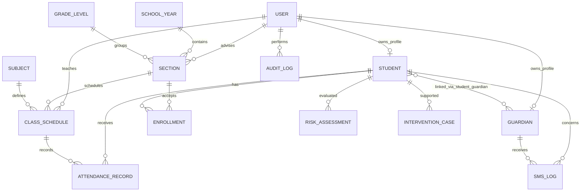

# Database Design

The initial schema deliberately includes downstream entities so relationships and deletion behavior are stable before feature sprints. Fields may expand as school policy is validated.

## Key constraints

- Usernames and learner reference numbers are unique.
- A section name is unique within grade level and school year.
- Enrollment is unique per student and section.
- Guardian linking is unique per student/guardian pair.
- Attendance is unique per student/class schedule/date.
- SMS event keys are unique to make repeat processing idempotent.
- Risk assessment is unique per student/day.

## Retention and deletion

Operational records use `PROTECT` for students, users, and schedules referenced by history. User/profile links that are optional use `SET_NULL`. Hard deletion policies are not enabled until the school approves retention and anonymization rules.
